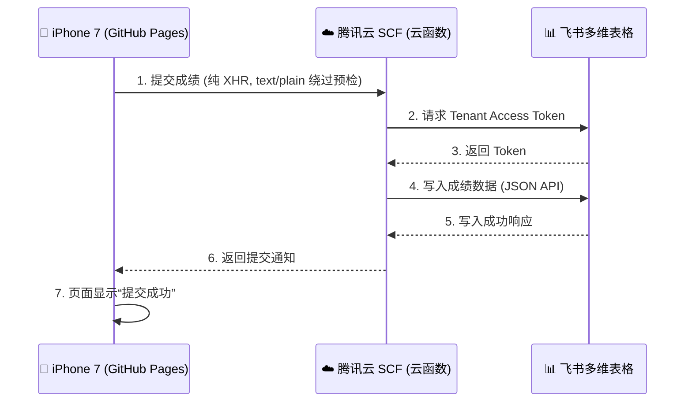

# 📚 Weekly Quiz (三年级下) - 架构说明与开发经验总结

这份文档记录了本项目从无到有，特别是为了适配 **iPhone 7 (iOS 12)** 和**国内网络环境**所踩过的坑以及最终定型的架构。请在后续开发新 App 或者维护本项目时，随时翻阅此文。

---

## 🏗️ 1. 当前系统架构 (一目了然)

本系统采用 **前端 (静态网页) + 代理后端 (无服务器云函数) + 数据库 (飞书多维表格)** 的轻量级架构。

### 详细模块说明：
1. **前端部署 (GitHub Pages)**:
   - 代码托管在 GitHub，通过 GitHub Pages 提供稳定的 HTTPS 静态托管。
   - 所有逻辑（判题、计分、UI交互）都在用户的设备上使用原生 Vanilla JavaScript 运行。
2. **代理后端 (腾讯云 SCF)**:
   - **网址**: `https://1316992450-7lwf0xnb7d.ap-guangzhou.tencentscf.com/`
   - **作用**: 充当“中转站”和“鉴权中心”。因为前端不能直接暴露飞书的 `App Secret`，必须由后端向飞书请求 Token 并写入数据。
   - **优势**: 国内服务器，访问极速，彻底解决了 Cloudflare 在国内被墙的问题。
3. **数据库 (飞书多维表格)**:
   - 作为后台管理系统，实时接收并结构化存储学生的考试成绩，方便老师统计和查阅。

---

## ⚠️ 2. 踩坑记录与经验教训（价值千金）

为了适配 6 台没有任何翻墙环境的 **iPhone 7 (iOS 12 Safari)**，我们排除了无数个疑难杂症。在以后开发新 App（如期末复习 App 等）时，**必须严守以下几条铁律**：

### 🚨 铁律一：坚决不用被墙的国外 Serverless 服务
* **踩坑**: 最初使用了 Cloudflare Workers (`*.workers.dev`) 作为中转后端，在 iPhone 12 (带代理) 上测试一切完美，但在学校网络的 iPhone 7 上无限“网络超时”。
* **原因**: 域名被 GFW（防火墙）阻断，国内直接断联。
* **教训**: **只要是面向国内学生使用的 App，后端必须部署在国内！** 首选 **腾讯云 SCF (云函数)** 或 **阿里云 FC**。它们都有免费额度且无需复杂的备案即可绑定默认的公网 API。

### 🚨 铁律二：避免复杂的网络请求栈 (`fetch` / `Promise.race`)
* **踩坑**: 前端提交最初使用了 ES6 的 `fetch()` API 并结合 `Promise.race[]` 来做超时控制。这在旧版 iOS (Safari 12) 上极不稳定，经常默默挂掉或抛出未捕获异常。
* **教训**: 对于兼容老设备，最底层的网络请求**必须回退使用老旧但最稳如老狗的 `XMLHttpRequest` (XHR)**。

### 🚨 铁律三：绕过讨厌的 CORS (跨域) 预检请求 (OPTIONS)
* **踩坑**: 即使用了 XHR，iPhone 7 依然报“网络连接失败”。
* **原因**: 当你发送 `Content-Type: application/json` 时，浏览器出于安全机制，会**先偷偷发一个 OPTIONS 预检请求**。在老系统或特殊网络下，这个预检极易失败，导致实际的 POST 请求根本没发出去。
* **教训**: **把 `Content-Type` 改为 `text/plain`**！这属于“简单请求 (Simple Request)”，浏览器会**直接发送 POST 数据**。虽然我们发的是字符串化后的 JSON，但服务器端只要直接 `JSON.parse(body)` 就行了，完美绕过前端各种跨域拦截！

### 🚨 铁律四：慎用 `navigator.sendBeacon` 发送 JSON
* **踩坑**: 我们曾尝试用专门为后台静默提交设计的 `sendBeacon(url, Blob)` 来确保离开页面也能提交成功。但在 iOS 12 上，它不仅会把 Body 格式弄坏，导致 JSON 失效，还会直接弄崩腾讯云函数（报 `145 code exit unexpected` 核心错误）。
* **教训**: 除非仅发送简单的纯文本，否则**在旧版 iOS 上抛弃 sendBeacon**，坚持用带 `timeout` 的 XHR。

---

## 📝 3. 未来新 App 的开发流程模版

以后你要给学生做新的交互式 App，可以直接套用以下流程：

1. **界面与交互开发 (HTML/CSS/JS)**
   - 使用轻量级写法（不用大型框架 React/Vue，以降低老设备渲染压力）。
   - 在本地编写 `index.html`, `style.css`, `script.js` 并在浏览器测试。
2. **构建腾讯云后端 (`tencent_scf.js`)**
   - 复制本次项目里的 `tencent_scf.js` 模版代码。
   - 只需要修改代码里的 `LARK_APP_ID`, `LARK_APP_SECRET`, `LARK_APP_TOKEN`, 和 `LARK_TABLE_ID` 以及 `fields`（飞书表头对应的属性）。
3. **部署腾讯云函数**
   - 登录腾讯云 -> Serverless 云函数 -> 新建 -> Node.js 18.15。
   - 开启**公网访问**，代码编辑器里粘贴代码，点击**部署**。
   - 拿到云函数的访问链接（URL）。
4. **前端对接与发布**
   - 在前端的 `script.js` 里，使用 **纯 XHR + `text/plain`** 将数据 POST 到刚拿到的云函数 URL。
   - 用 GitHub Desktop 推送代码到 GitHub 仓库，等待 GitHub Pages 自动部署。
5. **真机最终测试**
   - 永远拿最旧的 **iPhone 7** 进行最后验收，如果它没问题，一切都没问题。

---

*“所谓的老旧设备兼容，就是把最花哨的技术剥离，用最朴素、最底层的积木重新搭建。这次战役我们打赢了，它将为你省下一大笔购买新测试设备的钱！”* 🌟
